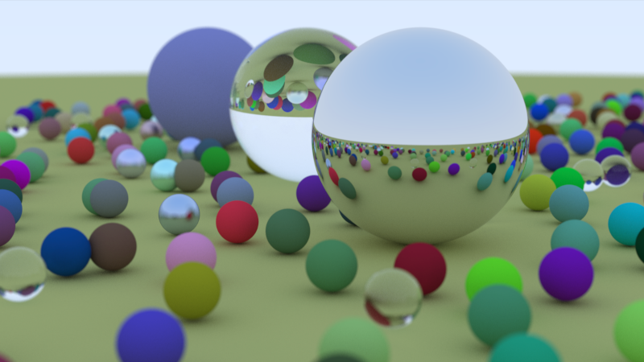

# Sparkito

> One day, a *tiny spark of inspiration* hit me, that it would be fun to develop
> my own renderer in C++, and embarked on this happy little project.

## Resources
- I started loosely following the [Ray Tracing in One Weekend Book Series](https://raytracing.github.io/) in my implementation.

After finishing [Ray Tracing in One Weekend](https://raytracing.github.io/books/RayTracingInOneWeekend.html):

